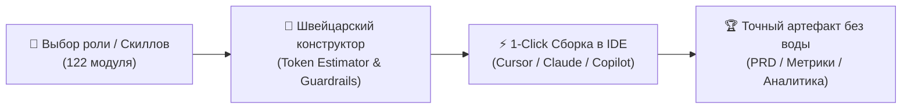

<div align="center">

# 🧠 PdM-Skills Builder

### Модульный компилятор системных правил ИИ для продакт-менеджеров

[](https://anton-creates.github.io/pdm-skills-builder/)
[](https://anton-creates.github.io/pdm-skills-builder/)
[](https://anton-creates.github.io/pdm-skills-builder/)
[](https://t.me/anton_product)

<br/>

**Никакого ИИ-слопа. Никаких «волшебных промптов на 100 страниц», размывающих контекст модели.**  
Сфокусированная библиотека из **122 изолированных системных инструкций** с жесткими Guardrails, упакованная в веб-конструктор с моментальным экспортом в вашу IDE.

<br/>

👉 **[🚀 ЗАПУСТИТЬ ОНЛАЙН ВЕБ-КОНСТРУКТОР](https://anton-creates.github.io/pdm-skills-builder/)** 👈

---

</div>

<br/>

## ⚡ В чем ключевое отличие от обычных промптов?

Большинство ИИ-инструкций в сети страдают от **AI-галлюцинаций и размытия внимания (Attention Degradation)**: когда в один запрос пихают всё подряд, LLM выдает водянистые, шаблонные ответы.

**PdM-Skills Builder решает эту проблему модульно:**



* 🧱 **Изолированные контексты:** Подключайте только те 3–5 навыков, которые нужны прямо сейчас под конкретную задачу.
* 🛡 **Жесткие ограничения (Guardrails):**
  * Правило **5 вопросов** для каждой предлагаемой метрики (Владелец, Частота, События, Порог решения, Защита от накрутки).
  * Запрет наводящих вопросов при подготовке к CustDev.
  * Обязательное проектирование Fallback-сценариев для AI/ML фичей.
  * Протокол Root-Cause расследования при падении бизнес-показателей.
* 📊 **Token Estimator:** Подсчет веса сборки правил в токенах в реальном времени с индикатором емкости контекстного окна (128k context-safe).
* 🔀 **Data-Dense интерфейс:** Поддержка двух тем (Light Editorial / Engineering Dark) и переключение между карточной сеткой и табличной матрицей с горизонтальным скроллом.

<br/>

---

## 🛠 Поддерживаемые форматы экспорта (9 IDE и Агентов)

Выбирайте нужный формат в выпадающем списке конструктора и скачивайте готовый `.zip` архив в один клик:

| Целевая среда | Формат файла | Назначение |
| :--- | :--- | :--- |
| **Универсальный промпт** | `SYSTEM_PROMPT.md` | Для веб-интерфейсов ChatGPT, Claude Web, DeepSeek |
| **Cursor IDE** | `.cursor/rules/*.mdc` | Модульные правила с описаниями и глоб-паттернами |
| **VS Code / Roo Code / Cline** | `.clinerules` | Системные инструкции для автономных кодинг-агентов |
| **GitHub Copilot** | `.github/copilot-instructions.md` | Официальный формат инструкций репозитория Copilot |
| **Windsurf IDE** | `.windsurfrules` | Правила контекста для Cascade Assistant |
| **Aider** | `CONVENTIONS.md` | Конвенции и правила для терминального агента Aider |
| **Pi Agent** | `APPEND_SYSTEM.md` | Дополнительный системный промпт |
| **Claude Code** | `CLAUDE.md` | Стандарт системных правил для CLI-агента Claude Code |
| **Gemini Antigravity** | `.agents/skills/*/SKILL.md` | Модульные исполняемые скиллы для Antigravity 2.0 |

<br/>

---

## 🗂 Каталог модулей библиотеки (122 Скилла)

<details open>
<summary><b>[01] 🎯 Ядро PdM (Core Delivery & Execution)</b></summary>

* `/prd` — Продуктовые требования с критериями приемки и нефункциональными требованиями.
* `/user-stories` — Пользовательские истории с Given-When-Then сценариями и негативными кейсами.
* `/roadmap` — Таймлайн-роадмап с фазами Now / Next / Later и оценкой рисков.
* `/prioritize` — Приоритизация бэклога по RICE, ICE, WSJF и Kano.
* `/decision-doc` — Архитектурные и продуктовые Decision Records (ADR / PDR) с фиксацией Trade-offs.
* `/metrics-analyzer` — Расследование падений метрик (Root-Cause Analysis), финтех-фильтры и когорты.
* `/ab-test-design` — Дизайн A/B-тестов, расчет MDE, выборки, P-peeking защита и Guardrail метрики.
* `/technical-translator` — Перевод сложных тех-ограничений бэкенда на язык бизнеса и метрик.
* `/launch-checklist` — Чек-лист предрелизного аудита, канареечного раската (Canary) и отката (Rollback).
* `/retro-facilitator` — Сценарии и фасилитация ретроспектив команды (Start/Stop/Continue, 4Ls).

</details>

<details>
<summary><b>[02] 🔍 Исследования и Discovery</b></summary>

* `/user-interview-prep` — Гайд качественного CustDev-интервью по фреймворку Mom Test без наводящих вопросов.
* `/customer-journey-map` — CJM полного цикла с точками трения, эмоциями и возможностями.
* `/discovery-sprint` — 2-недельный спринт валидации, Opportunity Solution Tree (OST) и Assumption Mapping.
* `/feedback-analyzer` — Кластеризация фидбека из саппорта, App Store и NPS в продуктовые инсайты.
* `/persona` — Описание целевой персоны (ICP) с триггерами покупки и критериями отказа.

</details>

<details>
<summary><b>[03] 📈 Рост, PLG и Монетизация (Growth)</b></summary>

* `/growth-loop` — Проектирование самоподдерживающихся петель роста (Viral, Content, Paid Loops).
* `/plg-design` — Product-Led Growth механики: Time-to-Value, виральный шеринг, бесшовный онбординг.
* `/onboarding-audit` — Аудит первых 5 минут в приложении и устранение точек отвала (Activation Drop-offs).
* `/retention-model` — Когортный анализ удержания, построение Retention Curve и поиск "Ага!-моментов".
* `/pricing-experiment` — Дизайн ценовых тестов (Van Westendorp, Gabor-Granger, Paywall A/B).
* `/monetization-audit` — Аудит тарифов, Freemium-ограничений и расчет потенциала ARPU.

</details>

<details>
<summary><b>[04] 💳 Финтех, Необанкинг и Эквайринг</b></summary>

* `/fintech-product-teardown` — Декомпозиция банковских фичей, рисков регуляторики и кредитного скоринга.
* `/trust-safety` — Противодействие фроду, AML/KYC комплаенс и защита от социальной инженерии.
* `/incident-pm-role` — Протокол работы PM во время аварий на проде, статус-пейджи и пост-мортемы.
* `/api-product-spec` — Спецификация API как продукта: SLA, Rate Limits (429), версионирование и DX/Sandbox.

</details>

<details>
<summary><b>[05] 🛍️ Маркетплейсы, E-com и Ритейл</b></summary>

* `/marketplace-catalog` — Архитектура товарного каталога, атрибуты, вариации и модерация.
* `/seller-economics` — Юнит-экономика мерчанта, комиссии (Take Rate) и калькуляторы окупаемости.
* `/marketplace-fraud` — Борьба с накрутками отзывов, самовыкупами и фейковыми треками.
* `/fulfillment-model` — Сравнение схем FBO / FBS / DBS и оптимизация стоимости последней мили.

</details>

<details>
<summary><b>[06] 🤖 AI, ML и Data Products</b></summary>

* `/ai-feature-spec` — Спецификация AI-фичи: ML-постановка, метрики (Precision/Recall vs Бизнес), Fallback и HITL.
* `/data-product-spec` — Спецификация витрин данных, DWH пайплайнов и SLA обновления аналитики.
* `/llm-product-design` — Промпт-инжиниринг, защита от инъекций, RAG-архитектура и оценка качества ответов (Evals).

</details>

<details>
<summary><b>[07] 🏢 Enterprise, B2B и Госсектор (B2G)</b></summary>

* `/enterprise-rollout` — План раската B2B-софта на тысячи сотрудников с минимизацией сопротивления.
* `/admin-ux` — Проектирование эргономичных бэк-офисов, массовых действий (Bulk) и журнала аудита (Audit Trail).
* `/public-service-design` — Проектирование госсервисов, соответствие ГОСТ/152-ФЗ и доступность (a11y).
* `/rfp-response` — Подготовка ответов на тендерные требования и технические задания.

</details>

<br/>

---

## 💻 Локальный запуск и разработка

Проект полностью автономен и не требует серверов или баз данных.

```bash
# 1. Клонировать репозиторий
git clone https://github.com/Anton-Creates/pdm-skills-builder.git

# 2. Перейти в директорию
cd pdm-skills-builder

# 3. Открыть веб-приложение
# Просто откройте index.html в любом современном браузере!
```

### Как добавить собственный скилл:
1. Создайте папку `skills/my-new-skill/` с файлом `SKILL.md`.
2. Запустите скрипт пересборки базы:
   ```bash
   python manager.py
   ```
3. Новый навык мгновенно появится в поиске и конструкторе!

<br/>

---

## 👨‍💻 Автор и Контакты

<table style="border: none; background: transparent;">
  <tr>
    <td width="80" align="center" style="border: none;">
      
    </td>
    <td style="border: none;">
      <b>Антон Михайлов (Anton.Creates)</b><br/>
      <i>Lead Product Manager · AI & Tech Solutions Builder</i><br/>
      <a href="https://t.me/anton_product">✈️ Telegram (@anton_product)</a> &nbsp;•&nbsp; 
      <a href="https://www.linkedin.com/in/anton-mikhaylove/">💼 LinkedIn</a> &nbsp;•&nbsp; 
      <a href="https://github.com/Anton-Creates">🐙 GitHub Profile</a>
    </td>
  </tr>
</table>

<br/>

## 📄 Лицензия

Распространяется под свободной лицензией **MIT License** — используйте в работе, делайте форки и ускоряйте запуск своих продуктов!
