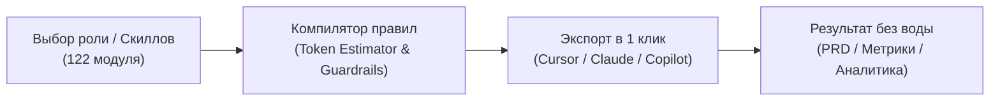

# PdM-Skills Builder

### Модульный компилятор системных правил ИИ для продакт-менеджеров

[](https://anton-creates.github.io/pdm-skills-builder/)
[](https://anton-creates.github.io/pdm-skills-builder/)
[](https://anton-creates.github.io/pdm-skills-builder/)
[](https://t.me/mikhaylove_anton)

[Запустить Web-конструктор онлайн (Live App)](https://anton-creates.github.io/pdm-skills-builder/)

---

Модульная библиотека из **122 изолированных системных инструкций** для продакт-менеджмента. Позволяет собирать точечный контекст и правила для ChatGPT, Claude, Cursor, Roo Code, Copilot и Antigravity без перегрузки контекстного окна.



---

## Архитектурные принципы

- **Изолированный контекст:** Вместо перегруженных универсальных промптов на десятки страниц — точечный выбор 3–5 целевых модулей под конкретную задачу.
- **Встроенные Guardrails:**
  - Обязательное правило 5 вопросов для любой предлагаемой метрики (владелец, частота замера, события расчета, порог решения, защита от накрутки).
  - Запрет наводящих вопросов в CustDev-исследованиях (методология Mom Test).
  - Требование проектирования Fallback-сценариев и HITL для всех AI/ML спецификаций.
  - Протокол Root-Cause расследования при падении бизнес-показателей.
- **Realtime Token Estimator:** Подсчет веса сборки правил в токенах и шкала заполнения контекстного окна (128k baseline).
- **Двухрежимный интерфейс:** Поддержка тем Light Editorial и Engineering Dark, переключение между карточной сеткой и табличной матрицей с горизонтальным скроллом.

---

## Поддерживаемые форматы экспорта (9 IDE и Агентов)

Конструктор генерирует готовый архив для целевой среды разработки:

| Среда / Инструмент | Формат файла | Описание |
| :--- | :--- | :--- |
| **Универсальный промпт** | `SYSTEM_PROMPT.md` | Для веб-интерфейсов ChatGPT, Claude Web, DeepSeek |
| **Cursor IDE** | `.cursor/rules/*.mdc` | Модульные правила с метаданными и глоб-паттернами |
| **VS Code / Roo Code / Cline** | `.clinerules` | Системные инструкции для автономных кодинг-агентов |
| **GitHub Copilot** | `.github/copilot-instructions.md` | Официальный формат инструкций репозитория |
| **Windsurf IDE** | `.windsurfrules` | Контекстные правила для Cascade Assistant |
| **Aider** | `CONVENTIONS.md` | Конвенции для терминального AI-ассистента |
| **Pi Agent** | `APPEND_SYSTEM.md` | Дополнительный системный промпт |
| **Claude Code** | `CLAUDE.md` | Стандарт системных инструкций для CLI Claude Code |
| **Gemini Antigravity** | `.agents/skills/*/SKILL.md` | Исполняемые скиллы для Antigravity 2.0 |

---

## Структура библиотеки (122 Скилла)

<details open>
<summary><b>[01] Ядро PdM (Core Delivery & Execution)</b></summary>

- `/prd` — Продуктовые требования с критериями приемки и нефункциональными требованиями.
- `/user-stories` — Пользовательские истории по Given-When-Then с негативными сценариями.
- `/roadmap` — Таймлайн-роадмап с фазами Now / Next / Later и оценкой рисков.
- `/prioritize` — Приоритизация бэклога по фреймворкам RICE, ICE, WSJF и Kano.
- `/decision-doc` — Архитектурные и продуктовые Decision Records (ADR / PDR) с фиксацией Trade-offs.
- `/metrics-analyzer` — Расследование падений метрик (Root-Cause Analysis), финтех-фильтры и когорты.
- `/ab-test-design` — Дизайн A/B-тестов, расчет MDE, выборки, P-peeking защита и Guardrail метрики.
- `/technical-translator` — Перевод технических ограничений архитектуры на язык бизнес-метрик.
- `/launch-checklist` — Чек-лист предрелизного аудита, канареечного раската (Canary) и отката (Rollback).
- `/retro-facilitator` — Сценарии и фасилитация ретроспектив команды (Start/Stop/Continue, 4Ls).

</details>

<details>
<summary><b>[02] Исследования и Discovery</b></summary>

- `/user-interview-prep` — Гайд качественного интервью по фреймворку Mom Test без наводящих вопросов.
- `/customer-journey-map` — CJM полного цикла с точками трения, эмоциями и возможностями.
- `/discovery-sprint` — 2-недельный спринт валидации, Opportunity Solution Tree (OST) и Assumption Mapping.
- `/feedback-analyzer` — Кластеризация обратной связи из саппорта, сторов и NPS.
- `/persona` — Описание целевой персоны (ICP) с триггерами покупки и барьерами.

</details>

<details>
<summary><b>[03] Рост, PLG и Монетизация (Growth)</b></summary>

- `/growth-loop` — Проектирование самоподдерживающихся петель роста (Viral, Content, Paid Loops).
- `/plg-design` — Product-Led Growth механики: Time-to-Value, виральный шеринг, бесшовный онбординг.
- `/onboarding-audit` — Аудит первых 5 минут в продукте и устранение точек отвала (Activation Drop-offs).
- `/retention-model` — Когортный анализ удержания, построение Retention Curve и поиск Aha-моментов.
- `/pricing-experiment` — Дизайн ценовых тестов (Van Westendorp, Gabor-Granger, Paywall A/B).
- `/monetization-audit` — Аудит тарифов, Freemium-ограничений и расчет потенциала ARPU.

</details>

<details>
<summary><b>[04] Финтех, Необанкинг и Эквайринг</b></summary>

- `/fintech-product-teardown` — Декомпозиция банковских сервисов, рисков регуляторики и скоринга.
- `/trust-safety` — Противодействие фроду, AML/KYC комплаенс и защита от социальной инженерии.
- `/incident-pm-role` — Протокол работы PM во время аварий на проде, статус-пейджи и пост-мортемы.
- `/api-product-spec` — Спецификация API как продукта: SLA, Rate Limits (429), версионирование и DX/Sandbox.

</details>

<details>
<summary><b>[05] Маркетплейсы, E-com и Ритейл</b></summary>

- `/marketplace-catalog` — Архитектура товарного каталога, атрибуты, вариации и модерация.
- `/seller-economics` — Юнит-экономика мерчанта, комиссии (Take Rate) и калькуляторы окупаемости.
- `/marketplace-fraud` — Борьба с накрутками отзывов, самовыкупами и фейковыми треками.
- `/fulfillment-model` — Сравнение схем FBO / FBS / DBS и оптимизация стоимости последней мили.

</details>

<details>
<summary><b>[06] AI, ML и Data Products</b></summary>

- `/ai-feature-spec` — Спецификация AI-фичи: ML-постановка, метрики (Precision/Recall vs Бизнес), Fallback и HITL.
- `/data-product-spec` — Спецификация витрин данных, DWH пайплайнов и SLA обновления аналитики.
- `/llm-product-design` — Промпт-инжиниринг, защита от инъекций, RAG-архитектура и оценка качества ответов (Evals).

</details>

<details>
<summary><b>[07] Enterprise, B2B и Госсектор (B2G)</b></summary>

- `/enterprise-rollout` — План раската B2B-софта на корпоративных пользователей.
- `/admin-ux` — Проектирование бэк-офисов, массовых действий (Bulk) и журнала аудита (Audit Trail).
- `/public-service-design` — Проектирование госсервисов, соответствие 152-ФЗ и доступность (a11y).
- `/rfp-response` — Подготовка ответов на тендерные требования и технические задания.

</details>

---

## Локальный запуск

Проект автономен, работает в статическом режиме и не требует серверов или баз данных.

```bash
# Клонировать репозиторий
git clone https://github.com/Anton-Creates/pdm-skills-builder.git

# Перейти в директорию
cd pdm-skills-builder

# Открыть веб-приложение
# Откройте index.html в любом браузере
```

### Добавление нового скилла:
1. Создайте папку `skills/my-new-skill/` с файлом `SKILL.md`.
2. Запустите пересборку базы:
   ```bash
   python manager.py
   ```
3. Новый модуль автоматически появится в каталоге и поиске.

---

## Автор и Контакты

**Антон Михайлов (Anton.Creates)** — Lead Product Manager / Tech Solutions Builder

- Telegram: [@mikhaylove_anton](https://t.me/mikhaylove_anton)
- LinkedIn: [linkedin.com/in/anton-mikhaylove](https://www.linkedin.com/in/anton-mikhaylove/)
- GitHub: [github.com/Anton-Creates](https://github.com/Anton-Creates)

---

## Лицензия

Распространяется под свободной лицензией **MIT License**.
