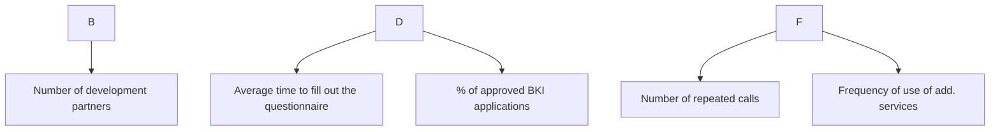

# North Star Metric


## Process

1. **Define the product's Core Value.** At what point does the user receive real value from the product (e.g., getting to a location in a taxi, getting approved for a mortgage, listening to a song)?

3. **Decompose NSM into leading metrics (Input Metrics).** Divide into 3-4 key drivers:
- *Breadth:* number of users (activations, new registrations).
- *Depth:* level of involvement (average number of actions per session, feature utilization).
- *Frequency:* regularity of use (DAU/MAU, session frequency).


## Output Format

```
## 

### 


1. *[Candidate 1, for example: Number of active users]* - Pros/Cons (why this is a vanity metric).
2. *[Candidate 2, for example: Number of completed applications]* - Pros/Cons.
3. *[Candidate 3 selected by NSM]* - Why it best reflects value and quality.

### 2. Selected North Star Metric (NSM)
- **NSM wording:** [name of time-based metric, e.g.: Weekly volume of successfully originated mortgages through the platform]
- **Why it works:** [how the growth of this metric ensures that clients are satisfied, partners make money, and the bank receives quality assets].

### 3. Metrics tree (Input Metrics)
Drivers that the team can optimize directly for NSM growth:



- **Driver 1: Breadth:** [metrics of audience volume, influx of new users].
- **Driver 2: Depth:** [metrics of quality of feature usage, conversion to key actions].
- **Driver 3: Frequency:** [return metrics, intervals between actions].

### 
- **Impact on Revenue (Revenue Link):** [how NSM growth increases contribution margin/commissions/interest].
- **Retention Link:** [how leveraging value reduces customer churn].

### 5. Guardrail Metrics

- *Quality/Risks:* [for example, the NPL (delay) level should not exceed 2.5% with an increase in issuances].
- *UX/Speed:* [technical support response time or percentage of stuck requests].
- *Economics:* [marginal cost of acquiring a CAC customer].
```

## Rules

- Prohibit the use of financial metrics (revenue, profit, GMV) or the number of registered users (MAU/registrations) as NSM. Revenue is a lagging indicator (output), and MAU is a vanity indicator. NSM must measure the delivery of value to the user.
- Be sure to implement Guardrail Metrics. Optimizing NSM without restrictions leads to fraud (for example, you can issue a lot of loans, reducing risk requirements, but the bank will receive a default portfolio).
- The metrics tree should be visualized through a Mermaid diagram.
- Write in English.

## Metrics

### Universal Metric Rule
If you propose a metric, answer these 5 questions:
1. **Who owns this metric?**
2. **How often do we track it?**
3. **What events calculate it?**
4. **What is the decision threshold?**
5. **How can it be gamed or corrupted?